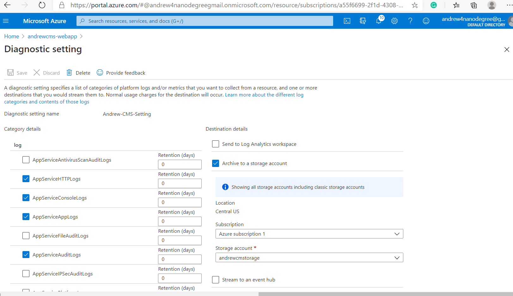

# Write-up : Deploy An Article CMS to Azure

## Andrew GE

### Analyze, choose, and justify the appropriate resource option for deploying the app.

*For **both** a VM or App Service solution for the CMS app:*

- *Analyze costs, scalability, availability, and workflow*
> **VM**: providing infrastructure as a service (IaaS) by allowing you to create and use virtual machines in the cloud.
- For VM solution, user do not need to purchase and maintain the hardware which lower the cost. 
- VMs are highly scalabile and flexible to configure. Users will have full access and control of the VM. The VMs can be grouped to provide high availability. 
- The CPU, memories and other resouces can be optimzed to fit the need.  As the demands changing, the VMs can be scaled up or down.
- As user has full control of the VM, all the OS, software packages and applications must be installed and maintained by the user.
- To deploy a web severvice, one need to initiate the VM, install the OS, put the software development packeages and actually using scripts or other means to start the web service.

> **App Service**: Azure App Service is a Platform as a Service (PaaS). It is an HTTP-based service for hosting web applications, REST APIs, and mobile back ends.
In this case the cloud provider,Azure, takes care of the infrastructure.
 
- Azure web service provide the flexible cost structure for appropriate hardware allocation to host the application. The cost is based on the plan selected.
- As stated in the NanoDegree lession, the Azure app service is Vertical or Horizontal scaling: _"Vertical scaling increases or decreases resources allocated to our App Service, 
such as the amount of vCPUs or RAM, by changing the App Service pricing tier. Horizontal scaling increases or decreases the number of Virtual Machine instances our App Service is running."_
- App service is deployed in the Azure cloud, it has high availability with local and geo-redundency.
- The app service can be deployed with automatic models, i.e., GitHub. 
- As the PaaS nature, the app service limit the access to underline OS and software package. User has to pay for the service plan, even if your services or application isn’t running.
There are hardware limitations, such as a maximum of 14GB of memory and 4 vCPU cores per instance.

- *Choose the appropriate solution (VM or App Service) for deploying the app*:

> In this project, I am chosing the **App Service** for deploying the app.
 
- *Justify your choice*

> For this project, the resource required is very limited. There is no chance to cross the upper limit of the app service provided. There are not special features that requiring the 
access of the OS and other specific software packet for this project. We do not need to install the OS and many supporting software packages. In addition, we are using Python with is a suported
language for the app service. This makes the deployment simple. In addtion, we can fork the Git from the provided template and develop features on top of it. From the cost point of view, the 
number of transcations and amount of CPU/memory are very limited. We can use the free plan for this App Service. 

### Assess app changes that would change your decision.

*Detail how the app and any other needs would have to change for you to change your decision in the last section.* 

**The project is using GitHub. The following link contains all the changes for the app and required screen shots**
https://github.com/andrew-ge/AzureDevProject1

**Screen shots are located in the _MyImages_ directory**

## The following are the changes on the app 

#### config.py

	class Config(object):
		SECRET_KEY = os.environ.get('SECRET_KEY') or 'secret-key'

		BLOB_ACCOUNT = os.environ.get('BLOB_ACCOUNT') or 'andrewcmstorage'
		BLOB_STORAGE_KEY = os.environ.get('BLOB_STORAGE_KEY') or 'VJugobhghiLDOeSEjQ/3zNznfaKZsbimr+jjWyyYpzE77k+FCePasmxmMZxfVXfFbidt1C213UC03yaRiHld+w=='
		BLOB_CONTAINER = os.environ.get('BLOB_CONTAINER') or 'images'

		SQL_SERVER = os.environ.get('SQL_SERVER') or 'andrewcms-server.database.windows.net'
		SQL_DATABASE = os.environ.get('SQL_DATABASE') or 'andrewcms-db'
		SQL_USER_NAME = os.environ.get('SQL_USER_NAME') or 'andrewcms'
		SQL_PASSWORD = os.environ.get('SQL_PASSWORD') or 'p@ssword123'
		# Below URI may need some adjustments for driver version, based on your OS, if running locally
		SQLALCHEMY_DATABASE_URI = 'mssql+pyodbc://' + SQL_USER_NAME + '@' + SQL_SERVER + ':' + SQL_PASSWORD + '@' + SQL_SERVER + ':1433/' + SQL_DATABASE  + '?driver=ODBC+Driver+17+for+SQL+Server'
		SQLALCHEMY_TRACK_MODIFICATIONS = False

		### Info for MS Authentication ###
		### As adapted from: https://github.com/Azure-Samples/ms-identity-python-webapp ###
		CLIENT_SECRET = "5WC0eqAvdG-x.fmSVNxR3N-X6_X0pCldK5"
		# In your production app, Microsoft recommends you to use other ways to store your secret,
		# such as KeyVault, or environment variable as described in Flask's documentation here:
		# https://flask.palletsprojects.com/en/1.1.x/config/#configuring-from-environment-variables
		# CLIENT_SECRET = os.getenv("CLIENT_SECRET")
		# if not CLIENT_SECRET:
		#     raise ValueError("Need to define CLIENT_SECRET environment variable")

		AUTHORITY = "https://login.microsoftonline.com/common"  # For multi-tenant app, else put tenant name
		# AUTHORITY = "https://login.microsoftonline.com/Enter_the_Tenant_Name_Here"

		CLIENT_ID = "6bb4f4c6-3b1e-447f-84e2-41aaae8c3035"

		REDIRECT_PATH = "/getAToken"  # Used to form an absolute URL; must match to app's redirect_uri set in AAD

		# You can find the proper permission names from this document
		# https://docs.microsoft.com/en-us/graph/permissions-reference
		SCOPE = ["User.Read"] # Only need to read user profile for this app

		SESSION_TYPE = "filesystem"  # Token cache will be stored in server-side session

In the above code, the neccessary configuration values are put into the file so that app can pick up the correct information to access the Azure resources (e.g., database). Also the 
redirect_path and secrets and keys are provided for the oauth2.

## __init__.py

	TODO: Add any logging levels and handlers with app.logger
	wsgi_app = app.wsgi_app
	app.logger.setLevel(logging.INFO)
	streamHandler = logging.StreamHandler()
	streamHandler.setLevel(logging.INFO)
	app.logger.addHandler(streamHandler)

**Issue in the logging**: I have setup the necessary loggoing level and at the app logging setting (see img)

## view.py

The follow procedure/functions are updated to complete the TODO's

##### authorized function:

	@app.route(Config.REDIRECT_PATH)  # Its absolute URL must match your app's redirect_uri set in AAD
	def authorized():
		if request.args.get('state') != session.get("state"):
			return redirect(url_for("home"))  # No-OP. Goes back to Index page
		if "error" in request.args:  # Authentication/Authorization failure
			return render_template("auth_error.html", result=request.args)
		if request.args.get('code'):
			cache = _load_cache()
			# TODO: Acquire a token from a built msal app, along with the appropriate redirect URI
			result = _build_msal_app(cache=cache).acquire_token_by_authorization_code(
				request.args['code'],
				scopes=Config.SCOPE,
				redirect_uri=url_for('authorized', _external=True, _scheme='https'))
			if "error" in result:
				return render_template("auth_error.html", result=result)
			session["user"] = result.get("id_token_claims")
			# Note: In a real app, we'd use the 'name' property from session["user"] below
			# Here, we'll use the admin username for anyone who is authenticated by MS
			user = User.query.filter_by(username="admin").first()
			login_user(user)
			_save_cache(cache)
		return redirect(url_for('home'))
		

##### _load_cache:
		
	def _load_cache():
		# TODO: Load the cache from `msal`, if it exists
		cache = msal.SerializableTokenCache()
		if session.get("token_cache"):
			cache.deserialize(session["token_cache"])
		return cache

##### _save_cache:

	def _save_cache(cache):
		# TODO: Save the cache, if it has changed
		if cache.has_state_changed:
			  session["token_cache"] = cache.serialize()

#####  _build_msal_app:

	def _build_msal_app(cache=None, authority=None):
		# TODO: Return a ConfidentialClientApplication
		return  msal.ConfidentialClientApplication(
		Config.CLIENT_ID,
		authority=authority or Config.AUTHORITY,
		client_credential=Config.CLIENT_SECRET, token_cache=cache)

##### _build_auth_url:

	def _build_auth_url(authority=None, scopes=None, state=None):
		# TODO: Return the full Auth Request URL with appropriate Redirect URI
		return _build_msal_app(authority=authority).get_authorization_request_url(
			scopes or [],
			state=state or str(uuid.uuid4()),
			redirect_uri=url_for('authorized', _external=True, _scheme='https'))

